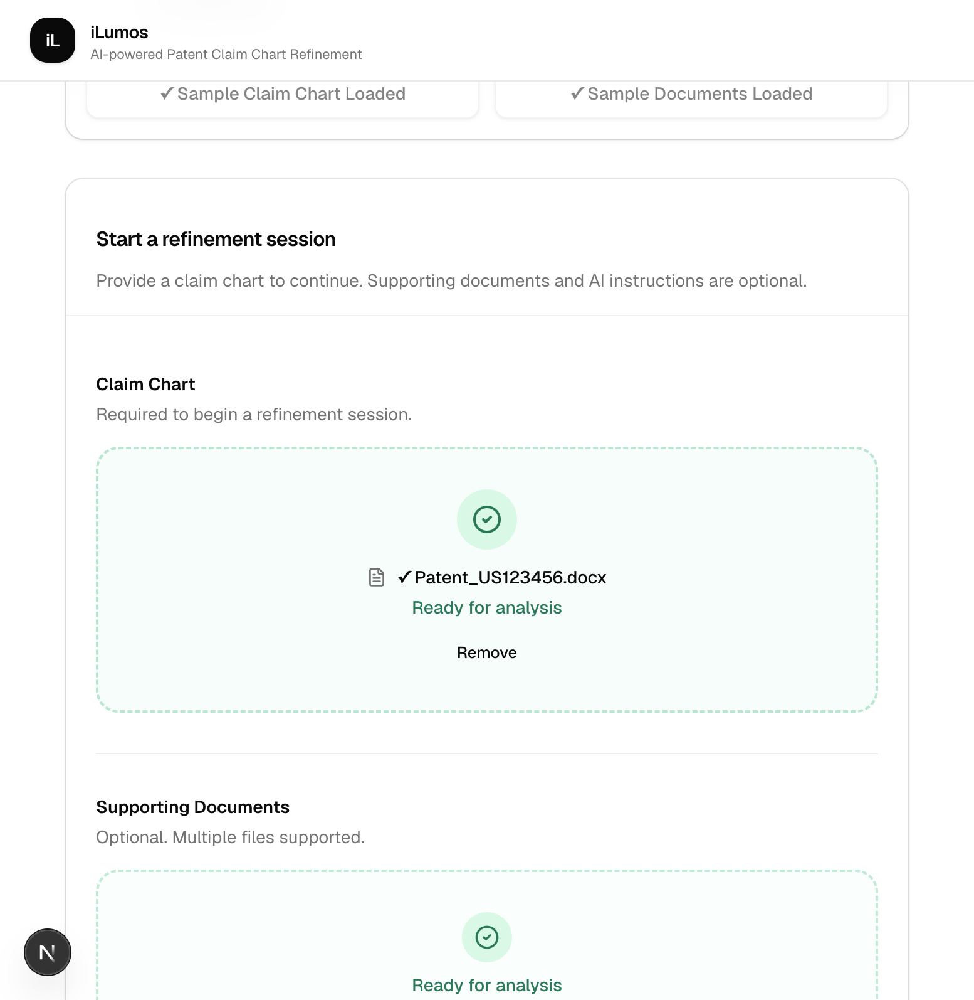
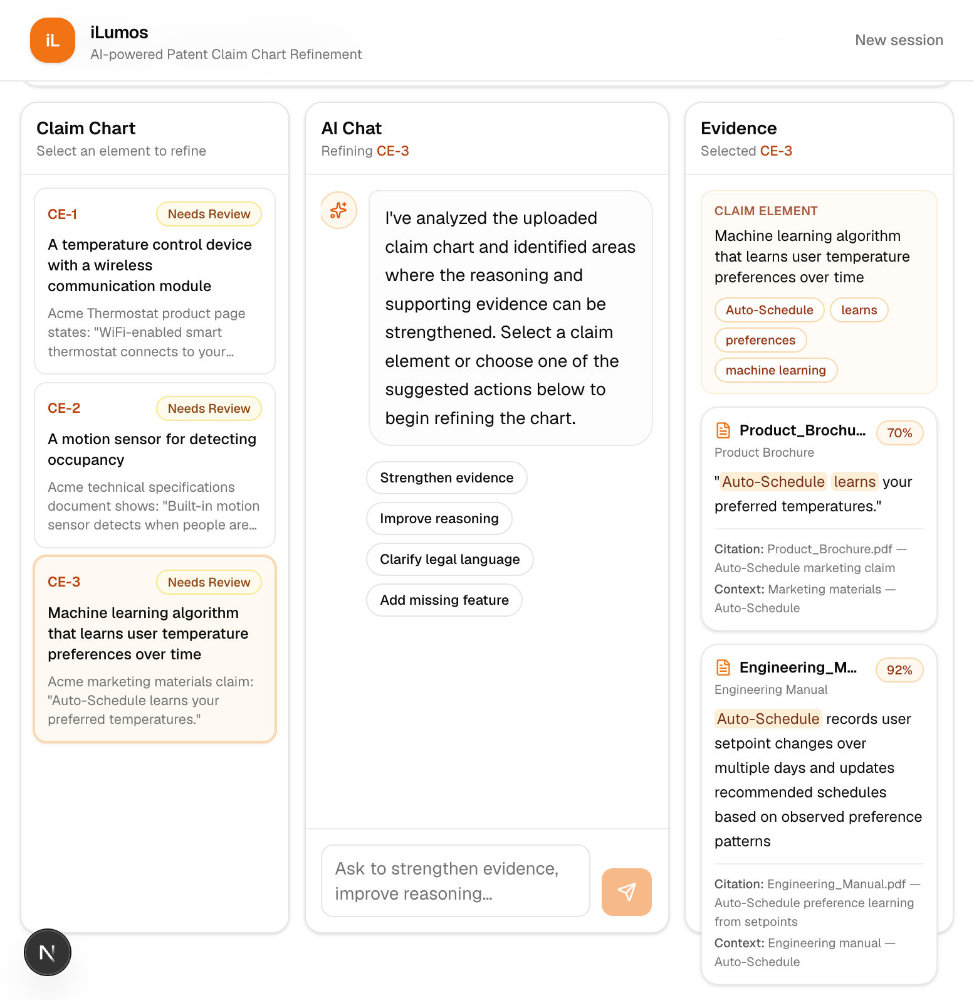
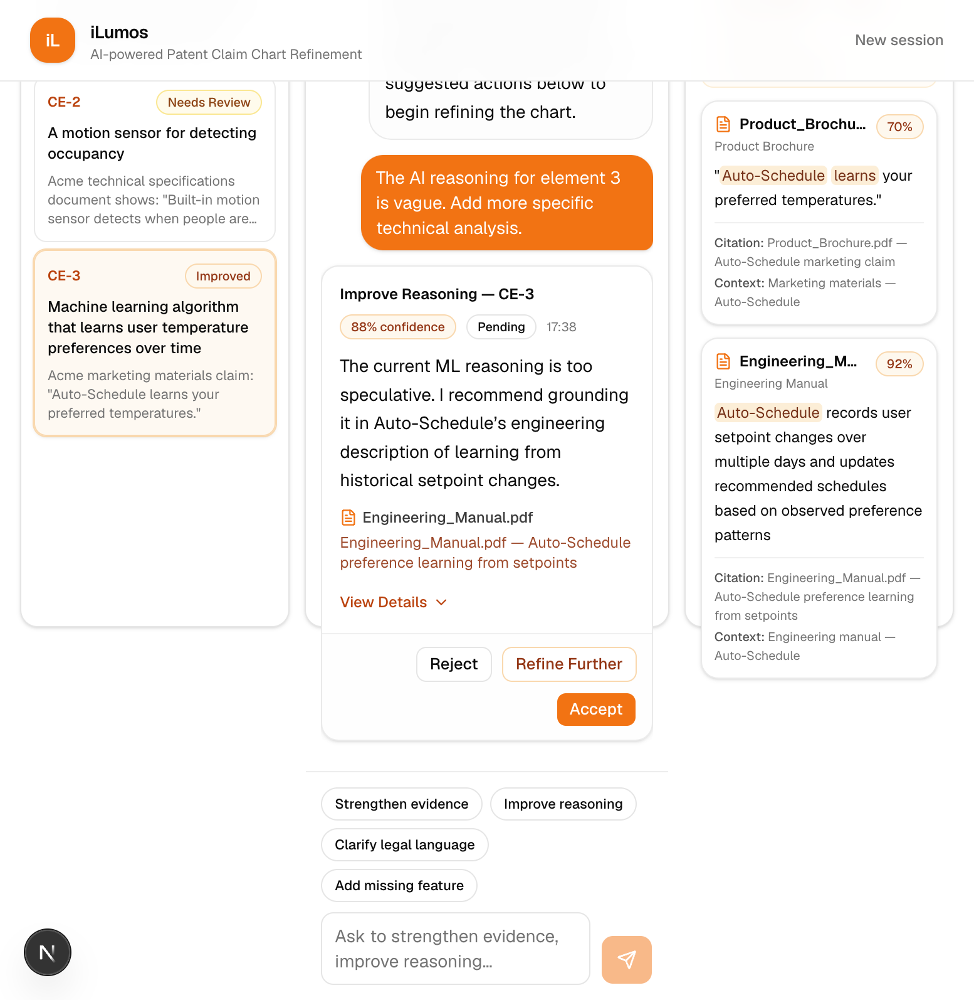
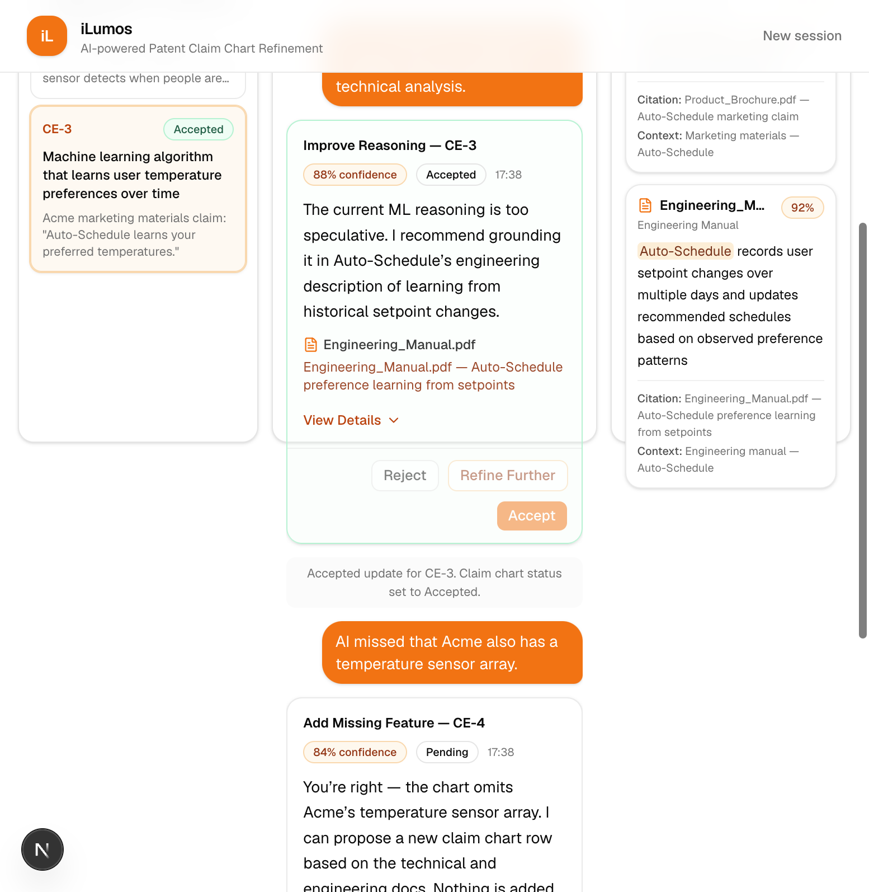

# iLumos — AI-Powered Patent Claim Chart Refinement

Conversational AI workspace for refining patent claim charts using evidence-backed AI suggestions with a human-in-the-loop review workflow.

*Built for the Lumenci Product Manager Assignment*

Analysts can load a sample matter, ask an AI assistant to strengthen reasoning or evidence, accept or reject suggestions, refine further through chat, and export the finalized chart to Microsoft Word — without switching between disconnected tools.

---

## Key Highlights

- 🤖 Live Gemini-powered AI refinement
- 📑 Evidence-backed reasoning and citations
- ✅ Human-in-the-loop Accept / Reject / Refine workflow
- 📄 Export reviewed claim charts to Microsoft Word
- ⚡ Mock fallback for offline demos

---

## 🌐 Live Demo

**Try it live:** [https://i-lumos.vercel.app](https://i-lumos.vercel.app)

Run locally anytime with the steps below (or use `NEXT_PUBLIC_AI_MODE=mock` for a key-free walkthrough).

---

## Problem statement

Patent claim charts map each claim element to accused-product features with supporting evidence and legal reasoning. AI drafts help, but they are rarely courtroom-ready. Today, analysts bounce between Word, PDFs, and chat tools, lose context, and lack a structured Accept / Reject / Refine loop.

iLumos keeps the **claim chart**, **AI conversation**, and **supporting evidence** in one workspace so the analyst remains the final decision-maker on every change.

See [`docs/01_ProblemStatement.md`](docs/01_ProblemStatement.md) for the full product problem statement.

---

## Features

| Capability | Description |
| --- | --- |
| **Setup / Quick Start** | Load the sample claim chart and supporting documents |
| **Three-panel workspace** | Claim Chart · AI Analysis · Supporting Evidence |
| **Suggested actions** | Strengthen Evidence, Improve Reasoning, Add Missing Feature, and related prompts |
| **Custom prompts** | Free-form refinement requests scoped to the selected claim |
| **Human review** | Accept, Reject, or Refine Further on every AI suggestion |
| **Live Gemini AI** | Structured JSON suggestions via Google Gemini (server-side) |
| **Mock fallback** | Demo-safe suggestions when Gemini is unavailable or mode is `mock` |
| **Export DOCX** | Download the current reviewed chart as `ClaimChart_US123456.docx` |
| **New Session** | Reset workspace state for a clean demo run |
| **Accessibility basics** | Keyboard focus, skip link, labeled controls, friendly errors |

---

## Architecture

```
Browser
    ↓
Workspace (Claim Chart · Chat · Evidence)
    ↓
POST /api/ai/refine
    ↓
Gemini (server-only)
    ↓
Parser
    ↓
Mapper → SuggestionPayload
    ↓
Suggestion Card
    ↓
Accept / Reject / Refine Further
    ↓
POST /api/export/docx
    ↓
Server-side DOCX generation (`docx`)
    ↓
Download (ClaimChart_US123456.docx)
```

**Notes**

- The Gemini API key never ships to the browser.
- On live failure (or `mock` mode), the workspace falls back to structured mock suggestions without changing the UI flow.
- Word export builds a snapshot on the client, then generates the `.docx` **on the server** so the `docx` package stays out of the client bundle.

Full detail: [`docs/07_Architecture.md`](docs/07_Architecture.md).

---

## Technology stack

[](https://nextjs.org/)
[](https://www.typescriptlang.org/)
[](https://react.dev/)
[](https://tailwindcss.com/)
[](https://ai.google.dev/)

| Layer | Choice |
| --- | --- |
| Framework | Next.js 15 (App Router) |
| Language | TypeScript |
| UI | React 19, Tailwind CSS 4, shadcn/ui, Lucide |
| AI | `@google/generative-ai` (Gemini) |
| Export | `docx` (server-side via `/api/export/docx`) |
| Tooling | ESLint, tsx scripts |

---

## Gemini integration

1. The workspace builds an `AIRequest` from the selected claim, evidence, and recent chat turns.
2. The browser calls **`POST /api/ai/refine`** (API key never ships to the client).
3. The route streams / invokes Gemini with a structured JSON schema and lean prompt.
4. The response is **parsed**, **validated**, and **mapped** into the existing `SuggestionPayload` UI model.
5. On success, a suggestion card appears in chat with Accept / Reject / Refine Further.

| Variable | Purpose |
| --- | --- |
| `GEMINI_API_KEY` | Server/script-only Gemini API key |
| `GEMINI_MODEL` | Model id (default in `.env.example`: `gemini-3.6-flash`) |

---

## Mock fallback

| `NEXT_PUBLIC_AI_MODE` | Behavior |
| --- | --- |
| `auto` (default) | Try live Gemini; on failure, fall back to mock |
| `mock` | Always use mock suggestions (no key required) |
| `live` | Prefer Gemini; still falls back to mock if the request fails |

Mock mode is ideal for demos without network or API quota. Live/auto modes use the same UI and Accept / Reject / Refine flow.

---

## Export DOCX

- Header control: **Export DOCX**
- Captures the **current** workspace state (accepted / pending / rejected / needs review)
- Client builds an export snapshot → **`POST /api/export/docx`** generates the Word file on the server
- Includes claim text, reasoning, confidence, evidence, latest accepted refinement only, and a summary
- Filename example: `ClaimChart_US123456.docx`
- Failures show a friendly error; AI state is not modified

---

## Folder structure

```
app/
  page.tsx                   # Setup / onboarding
  workspace/page.tsx         # AI workspace
  api/ai/refine/route.ts     # Gemini proxy (server-only)
  api/export/docx/route.ts   # DOCX generation (server-only)
components/
  layout/                    # Header, AppShell
  setup/                     # Onboarding UI
  workspace/                 # Panels, suggestion cards, export context
  ui/                        # shadcn primitives
data/
  mockWorkspace.ts           # Sample matter + mock suggestions
docs/                        # Product & engineering docs
lib/
  ai/                        # Prompt, Gemini, parse, map, bridge, errors
  export/                    # Snapshot + DOCX builders
scripts/                     # test:gemini, test:docx, measure:ai-prompt
types/                       # Domain TypeScript types
```

---

## Installation

```bash
git clone https://github.com/Rukhsar24081998/iLumos.git
cd iLumos
npm install
cp .env.example .env.local
```

Edit `.env.local` and set `GEMINI_API_KEY` if you want live AI. Leave it empty and/or set `NEXT_PUBLIC_AI_MODE=mock` for a key-free demo.

---

## Environment variables

Copy placeholders only — never commit real keys:

```bash
cp .env.example .env.local
```

| Variable | Required | Description |
| --- | --- | --- |
| `GEMINI_API_KEY` | For live AI | Google AI Studio / Gemini API key |
| `GEMINI_MODEL` | No | Model override (see `.env.example`) |
| `NEXT_PUBLIC_AI_MODE` | No | `auto` \| `mock` \| `live` |
| `AI_DEBUG` | No | `true` to force AI debug logs |

`.env`, `.env.local`, and `.env*.local` are gitignored. Only `.env.example` is committed.

---

## Running locally

```bash
npm run dev
```

Open [http://localhost:3000](http://localhost:3000).

Production-style local run:

```bash
npm run build
npm start
```

---

## Available scripts

| Script | Description |
| --- | --- |
| `npm run dev` | Next.js dev server (Turbopack) |
| `npm run build` | Production build |
| `npm start` | Serve production build |
| `npm run lint` | ESLint |
| `npm run test:gemini` | Smoke-test Gemini suggestion generation (needs key) |
| `npm run test:docx` | Validate DOCX export snapshot + ZIP signature |
| `npm run measure:ai-prompt` | Compare lean vs legacy prompt size |

---

## Demo walkthrough (~5 minutes)

Follow this sequence for a hiring-manager or reviewer demo. Full checklist: [`docs/08_DemoChecklist.md`](docs/08_DemoChecklist.md).

1. Set `NEXT_PUBLIC_AI_MODE=auto` (or `mock`) and run `npm run dev`
2. On Setup, use **Quick Start** to load the sample claim chart (and supporting documents)
3. Click **Start Analysis** to open the three-panel workspace
4. Select claim element **CE-3** (weak reasoning)
5. Click **Strengthen Evidence** or **Improve Reasoning** (or type a custom prompt)
6. Open **View Details** on the suggestion card — review reasoning, citations, and confidence
7. Optionally click **Refine Further** once to produce a newer version
8. Click **Accept** — confirm the claim chart updates
9. Click **Export DOCX** — open `ClaimChart_US123456.docx` in Microsoft Word
10. Optional edge case: **Reject** a suggestion and confirm chart reasoning is unchanged

---

## 📸 Screenshots

### Setup / Quick Start


### AI Workspace


### AI Suggestion


### Accepted Refinement


### Export DOCX


> Production screenshots will be added after capture. The README is already configured to render them automatically once committed.

---

## Documentation index

| Doc | Contents |
| --- | --- |
| [`docs/01_ProblemStatement.md`](docs/01_ProblemStatement.md) | Product problem |
| [`docs/02_ImplementationPlan.md`](docs/02_ImplementationPlan.md) | Phased delivery (Phases 1–9 ✅) |
| [`docs/03_UserFlow.md`](docs/03_UserFlow.md) | User flows |
| [`docs/04_MockData.md`](docs/04_MockData.md) | Sample matter |
| [`docs/05_UI_UX_Design.md`](docs/05_UI_UX_Design.md) | UI/UX notes |
| [`docs/06_PRD.md`](docs/06_PRD.md) | PRD |
| [`docs/07_Architecture.md`](docs/07_Architecture.md) | Technical architecture |
| [`docs/08_DemoChecklist.md`](docs/08_DemoChecklist.md) | Demo & QA checklist |

---

## Future improvements

| Area | Idea |
| --- | --- |
| Persistence | Refresh-safe sessions and real multi-document upload parsing |
| Review controls | True undo of accepted chart edits and richer version history |
| Evidence | Citation deep-links into PDF page/paragraph anchors |
| Quality | Stronger evaluation harness for suggestion quality |
| Collaboration | Auth, multi-user workspaces, and audit logging (out of MVP scope) |
| Delivery | Hosted deployment (e.g. Vercel) with server-only secrets |

---

## Known limitations

| Limitation | Detail |
| --- | --- |
| Session model | Single in-browser session (no database); **New Session** resets workspace |
| Uploads | Setup uploads are UI-scaffolded; the demo path uses seeded mock matter |
| AI quality | Depends on Gemini availability, model choice, and document fixtures |
| Export scope | Reflects current workspace state, not a separate “published” revision |
| Devices | No mobile-native app; desktop / laptop layout is the primary target |

---

## License

MIT License — see [`LICENSE`](LICENSE).

This prototype is provided for evaluation of the Lumenci Product Manager assignment.
